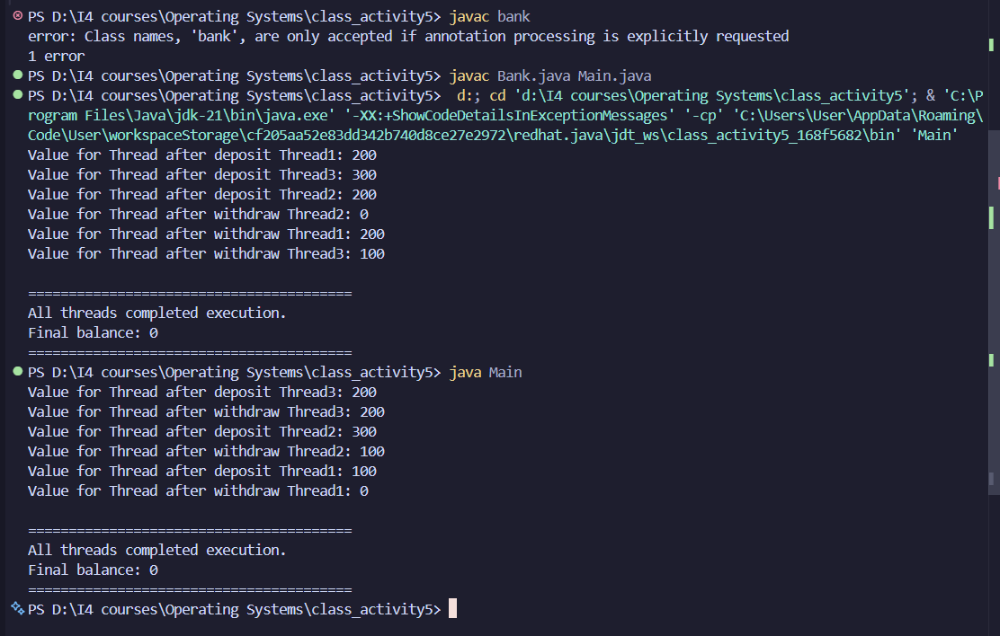

## REPORT OF OPERATING SYSTEMS

**Group:** I4-GIC(B)

---


| Name of Student | ID        | Score |
|-----------------|-----------|-------|
| THOUNG SOKET    | e20220586 |       |

**Lecturer:** HENG Rathpisey (Course & TP)  
**Academic Year:** 2025–2026

# MLFQ Scheduling Simulation Solution

## Problem Statement

A system uses the Multilevel Feedback Queue (MLFQ) scheduling algorithm with the following configuration:

### Queue Configuration
- **Q0**: Highest priority — uses Round Robin, Time Quantum = 2
- **Q1**: Medium priority — uses Round Robin, Time Quantum = 4
- **Q2**: Lowest priority — uses FCFS

### Priority Change Rules
1. All processes start in Q0
2. If a process exceeds its time quantum, it is moved to the next lower queue
3. A process that waits more than 10 time units in any lower-priority queue (Q1 or Q2) gets promoted back to the next higher queue
4. The scheduler always executes from the highest-priority non-empty queue

### Process Table

| Process | Arrival Time | Burst Time |
|---------|--------------|------------|
| P1      | 0            | 7          |
| P2      | 1            | 4          |
| P3      | 2            | 9          |
| P4      | 3            | 5          |

---

## Step-by-Step Execution

### Time 0-2: P1 runs from Q0
- P1 arrives at time 0 → placed in Q0
- P1 executes for 2 time units (Q0 quantum)
- P1 remaining burst: 7 - 2 = 5
- **P1 moves to Q1** (exceeded Q0 quantum)

### Time 1: P2 arrives
- P2 arrives → placed in Q0
- Waits because P1 is currently running

### Time 2-4: P2 runs from Q0
- P3 arrives at time 2 → placed in Q0 (waits)
- P2 executes for 2 time units (Q0 quantum)
- P2 remaining burst: 4 - 2 = 2
- **P2 moves to Q1** (exceeded Q0 quantum)

### Time 3: P4 arrives
- P4 arrives → placed in Q0
- Waits in Q0 behind P3

### Time 4-6: P3 runs from Q0
- Q0 has P3 and P4
- P3 executes for 2 time units (Q0 quantum)
- P3 remaining burst: 9 - 2 = 7
- **P3 moves to Q1** (exceeded Q0 quantum)

### Time 6-8: P4 runs from Q0
- P4 executes for 2 time units (Q0 quantum)
- P4 remaining burst: 5 - 2 = 3
- **P4 moves to Q1** (exceeded Q0 quantum)

### Time 8-12: P1 runs from Q1
- Q0 is empty, Q1 has P1, P2, P3, P4
- P1 executes for 4 time units (Q1 quantum)
- P1 remaining burst: 5 - 4 = 1
- **P1 moves to Q2** (exceeded Q1 quantum)

### Time 12-14: P2 runs from Q1
- P2 executes for 2 time units (completes)
- P2 remaining burst: 2 - 2 = 0
- **P2 completes at time 14**

### Time 14-18: P3 runs from Q1
- P3 executes for 4 time units (Q1 quantum)
- P3 remaining burst: 7 - 4 = 3
- **P3 moves to Q2** (exceeded Q1 quantum)

### Time 18-21: P4 runs from Q1
- P4 executes for 3 time units (completes)
- P4 remaining burst: 3 - 3 = 0
- **P4 completes at time 21**

### Time 21-22: P1 runs from Q2
- Q1 is empty, Q2 has P1, P3 (FCFS order)
- P1 executes for 1 time unit (completes)
- **P1 completes at time 22**

### Time 22-25: P3 runs from Q2
- P3 executes for 3 time units (completes)
- **P3 completes at time 25**

---

## Task 1: Gantt Chart of Process Execution

```
Time:  0   2   4   6   8   12  14  18  21  22  25
      |---|---|---|---|---|---|---|---|---|---|
      | P1| P2| P3| P4| P1| P2| P3| P4| P1| P3|
      |---|---|---|---|---|---|---|---|---|---|
Queue: Q0  Q0  Q0  Q0  Q1  Q1  Q1  Q1  Q2  Q2
```

### Execution Timeline:
- **Time 0-2**: P1 runs (Q0)
- **Time 2-4**: P2 runs (Q0)
- **Time 4-6**: P3 runs (Q0)
- **Time 6-8**: P4 runs (Q0)
- **Time 8-12**: P1 runs (Q1)
- **Time 12-14**: P2 runs (Q1) → **Completes**
- **Time 14-18**: P3 runs (Q1)
- **Time 18-21**: P4 runs (Q1) → **Completes**
- **Time 21-22**: P1 runs (Q2) → **Completes**
- **Time 22-25**: P3 runs (Q2) → **Completes**

---

## Task 2: Queue Transitions

| Process | Queue Transitions    |
|---------|---------------------|
| P1      | Q0 → Q1 → Q2       |
| P2      | Q0 → Q1            |
| P3      | Q0 → Q1 → Q2       |
| P4      | Q0 → Q1            |

### Detailed Transitions:

**P1:**
- Starts in Q0 at time 0
- Moves to Q1 at time 2 (after using Q0 quantum)
- Moves to Q2 at time 12 (after using Q1 quantum)

**P2:**
- Starts in Q0 at time 1
- Moves to Q1 at time 4 (after using Q0 quantum)
- Completes in Q1 at time 14

**P3:**
- Starts in Q0 at time 2
- Moves to Q1 at time 6 (after using Q0 quantum)
- Moves to Q2 at time 18 (after using Q1 quantum)

**P4:**
- Starts in Q0 at time 3
- Moves to Q1 at time 8 (after using Q0 quantum)
- Completes in Q1 at time 21

---

## Task 3: Calculate Completion Time, Turnaround Time, and Waiting Time

### Process P1:
- **Arrival Time**: 0
- **Burst Time**: 7
- **Completion Time (CT)**: 22
- **Turnaround Time (TAT)**: CT - Arrival Time = 22 - 0 = **22**
- **Waiting Time (WT)**: TAT - Burst Time = 22 - 7 = **15**

### Process P2:
- **Arrival Time**: 1
- **Burst Time**: 4
- **Completion Time (CT)**: 14
- **Turnaround Time (TAT)**: CT - Arrival Time = 14 - 1 = **13**
- **Waiting Time (WT)**: TAT - Burst Time = 13 - 4 = **9**

### Process P3:
- **Arrival Time**: 2
- **Burst Time**: 9
- **Completion Time (CT)**: 25
- **Turnaround Time (TAT)**: CT - Arrival Time = 25 - 2 = **23**
- **Waiting Time (WT)**: TAT - Burst Time = 23 - 9 = **14**

### Process P4:
- **Arrival Time**: 3
- **Burst Time**: 5
- **Completion Time (CT)**: 21
- **Turnaround Time (TAT)**: CT - Arrival Time = 21 - 3 = **18**
- **Waiting Time (WT)**: TAT - Burst Time = 18 - 5 = **13**

---

## Results Summary Table

| Process | Arrival Time | Burst Time | Completion Time (CT) | Turnaround Time (TAT) | Waiting Time (WT) |
|---------|--------------|------------|---------------------|----------------------|-------------------|
| P1      | 0            | 7          | 22                  | 22                   | 15                |
| P2      | 1            | 4          | 14                  | 13                   | 9                 |
| P3      | 2            | 9          | 25                  | 23                   | 14                |
| P4      | 3            | 5          | 21                  | 18                   | 13                |

### Average Performance Metrics:
- **Average Completion Time**: (22 + 14 + 25 + 21) / 4 = **20.5 time units**
- **Average Turnaround Time**: (22 + 13 + 23 + 18) / 4 = **19.0 time units**
- **Average Waiting Time**: (15 + 9 + 14 + 13) / 4 = **12.75 time units**

---

## Task 4: Identify Process Promotions Due to Long Wait Times

### Wait Time Analysis

A process is promoted if it waits **more than 10 time units** in Q1 or Q2 before being scheduled.

#### P1 Wait Times:
- **In Q1**: Entered at time 2, executed at time 8 → Wait = 6 time units (no promotion)
- **In Q2**: Entered at time 12, executed at time 21 → Wait = 9 time units (no promotion)

#### P2 Wait Times:
- **In Q1**: Entered at time 4, executed at time 12 → Wait = 8 time units (no promotion)

#### P3 Wait Times:
- **In Q1**: Entered at time 6, executed at time 14 → Wait = 8 time units (no promotion)
- **In Q2**: Entered at time 18, executed at time 22 → Wait = 4 time units (no promotion)

#### P4 Wait Times:
- **In Q1**: Entered at time 8, executed at time 18 → Wait = 10 time units (no promotion, exactly 10, not more than 10)

### Conclusion

**No process promotions occurred** during this simulation. 

All processes had wait times of 10 or fewer time units in lower-priority queues. The promotion rule requires waiting **more than 10 time units**, and no process exceeded this threshold before being scheduled.

---

### Bank Java

## Race Condition Diagram

